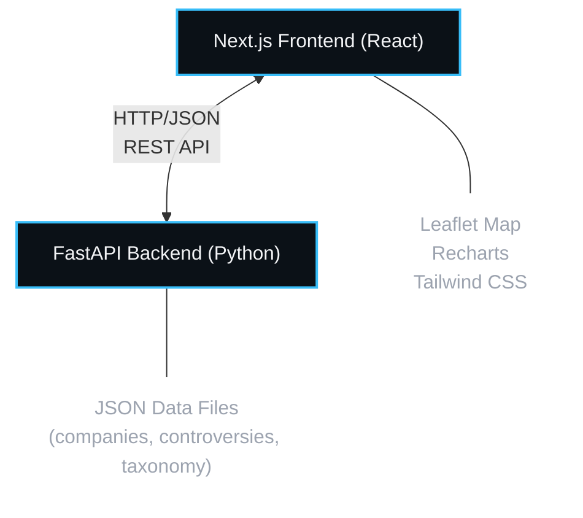

# ESG Controversy Signal Map (POC 66)

A production-grade corporate governance intelligence platform under the **Governance & Trust** rail category of the Real Rails Intelligence Library. This platform transforms unstructured ESG controversy data from global feeds (GDELT) and corporate disclosures (SEC EDGAR) into high-fidelity, actionable compliance risk dossiers.

---

## Architecture



---

## Core Features

- **Geospatial Signal Map:** Interactive Leaflet map styled for dark mode using CartoDB Dark Matter tiles. Renders dynamic markers with animated "ping" signals representing severity levels.
- **Dynamic Scoring Engine:** Computes risk levels based on:
  $$\text{Severity} = \text{Source Weight} + \text{Recency Weight} + \text{Repetition Weight} + \text{Category Weight}$$
- **Company Dossiers:** High-density sidebars detailing corporate metadata, average compliance severity levels, news streams (GDELT), and regulatory filings (SEC EDGAR).
- **Multi-Dimensional Filtration:** Filter by country, sector, company, ESG category, minimum severity, and date range.
- **Analytical Charting:** Dynamic trends showing controversy counts over time, category pillar densities, and sector risk rankings.
- **One-Click Export:** Download CSV reports containing detailed controversy profiles for any filtered view.

---

## Tech Stack

| Layer | Technology |
| :--- | :--- |
| **Frontend** | Next.js 16 (App Router), TypeScript, Tailwind CSS |
| **Visualization** | Leaflet Map, React Leaflet, Recharts |
| **Backend** | FastAPI, Python |
| **Data** | Synthetic dataset (50 companies, 229 controversies, taxonomy) |
| **Styling** | Bloomberg-inspired dark theme with Inter font |

---

## Folder Structure

```
POC-66-ESG-Controversy-Signal-Map/
│
├── backend/
│   ├── app/
│   │   ├── main.py                 # FastAPI Entrypoint & overview routes
│   │   ├── routes/
│   │   │   ├── companies.py        # GET /api/companies
│   │   │   ├── controversies.py    # GET /api/controversies
│   │   │   ├── trends.py           # GET /api/trends (Pandas aggregation)
│   │   │   └── taxonomy.py         # GET /api/taxonomy
│   │   │
│   │   ├── services/
│   │   │   ├── controversy_engine.py  # Severity engine & data seeder
│   │   │   ├── gdelt_service.py       # News headline simulator
│   │   │   └── edgar_service.py       # SEC disclosure simulator
│   │   │
│   │   ├── models/
│   │   │   └── schemas.py          # Pydantic validation schemas
│   │   │
│   │   └── data/                   # JSON databases (Generated on startup)
│   │       ├── companies.json
│   │       ├── controversies.json
│   │       └── taxonomy.json
│   │
│   └── requirements.txt
│
├── frontend/
│   ├── app/
│   │   ├── globals.css             # Tailwind v4 directives & Leaflet styling
│   │   ├── layout.tsx              # SEO tags & HTML layouts
│   │   └── page.tsx                # Main client page, state, & skeleton UI
│   │
│   ├── components/
│   │   ├── map/
│   │   │   └── SignalMap.tsx       # Leaflet implementation & custom icons
│   │   ├── cards/
│   │   │   └── CompanyCard.tsx     # Company profile & dossiers
│   │   ├── charts/
│   │   │   ├── TrendChart.tsx      # Controversies over time chart
│   │   │   ├── CategoryChart.tsx   # ESG categories density bar chart
│   │   │   └── SectorChart.tsx     # Industry sector horizontal risk ranking
│   │   ├── sidebar/
│   │   │   └── IntelligenceSidebar.tsx # Metrics overview, Why it matters narrative
│   │   └── filters/
│   │       └── FilterPanel.tsx     # Interactive dropdowns and filters
│   │
│   └── lib/
│       └── api.ts                  # API fetch client & client-side CSV generator
│
└── README.md
```

---

## Installation & Setup

### 1. Prerequisites
- Python 3.10+
- Node.js 18+ & NPM

### 2. Run Backend
1. Navigate to the backend directory:
   ```bash
   cd backend
   ```
2. Install Python dependencies:
   ```bash
   pip install -r requirements.txt
   ```
3. Generate mock databases (optional; will run automatically on server start):
   ```bash
   python app/services/controversy_engine.py
   ```
4. Start the FastAPI development server:
   
   **Windows (PowerShell/CMD):**
   ```bash
   python -m uvicorn app.main:app --host 0.0.0.0 --port 8000 --reload
   ```
   
   **macOS/Linux:**
   ```bash
   uvicorn app.main:app --host 0.0.0.0 --port 8000 --reload
   ```
   
   The backend API will be available at `http://localhost:8000`.

### 3. Run Frontend
1. Navigate to the frontend directory:
   ```bash
   cd ../frontend
   ```
2. Install Node packages (using `--legacy-peer-deps` due to React 19 / Recharts configurations):
   ```bash
   npm install --legacy-peer-deps
   ```
3. Start the Next.js development server:
   ```bash
   npm run dev
   ```
   Open `http://localhost:3000` in your web browser.

---

## Live Data Fetching

### How It Works

The backend implements **real-time data enrichment** when users drill down into specific companies:

- **GDELT News Feed (`gdelt_service.py`):** 
  - Queries Google News RSS for articles matching company name + ESG category
  - Extracts headlines, URLs, and source domains
  - Falls back to simulated high-fidelity data if live fetch fails

- **SEC EDGAR Filings (`edgar_service.py`):**
  - Queries Google News RSS for SEC filings (site:sec.gov)
  - Extracts filing types (8-K, 10-Q, 10-K) and risk factor disclosures
  - Falls back to simulated disclosures if live fetch unavailable

### Triggering Live Fetch

Live enrichment is **triggered automatically** when:
1. User clicks a company marker on the map, OR
2. User selects a company from the filter dropdown

**Live fetch does NOT occur** for bulk controversy lists (improves performance).

### Fallback Behavior

All live data requests have **timeout protection (5 seconds)** and **graceful degradation**:
- If Google News RSS is unavailable or slow → synthetic but realistic data is used
- Simulated data maintains same schema and quality as real data
- Users always see populated company dossiers (no blank fields)

---

## Future Improvements
- **Live GDELT Integration:** Connect to the real-time GDELT Project API to stream live news signals rather than simulated events.
- **Machine Learning Sentiment Extraction:** Incorporate transformers (e.g. FinBERT) on SEC filings and news to verify and validate controversy severities.
- **Geographic Clustered Maps:** Employ `react-leaflet-markercluster` to aggregate thousands of markers at high zoom scales cleanly.
